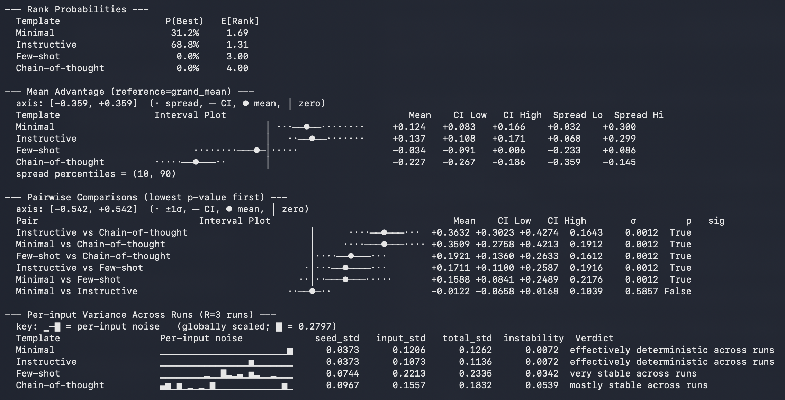
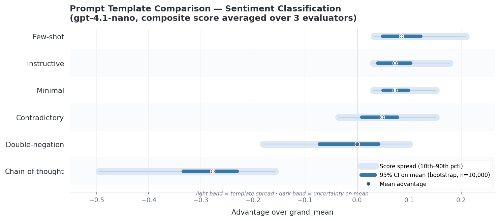
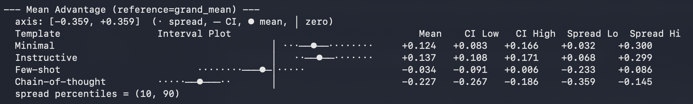
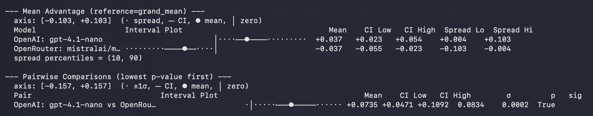
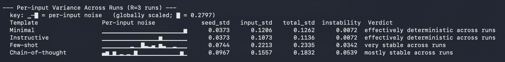

# promptstats

Utilities for statistically sane analyses for comparing prompt and LLM performance. Compute statistics and visualize the results.

`promptstats` helps you answer questions like:
 - Is Prompt A actually better than Prompt B, or just slightly luckier on this dataset?
 - Does Model A beat Model B, or only under a specific prompt phrasing?
 - How sensitive is model performance to prompt wording?
 - Are my performance differences large enough to be meaningful, or just noise?
 - How stable are scores across runs, evaluators, or inputs?

The idea is simple: you give `promptstats` your benchmark data, and it runs statistically appropriate analyses that quantify uncertainty and provide confidence bounds on your claims. Datasets can include eval scores, prompts, inputs, evaluator names, and (optionally) models. `promptstats` provides:
- Plots and tests comparing prompt performance, with bootstrapped CIs and variance
- Plots and tests comparing model performance across prompt variations
- Constraints that guide you into performing best practices, like always considering prompt sensitivity when benchmarking model performance

**How does this differ from ChainForge?** I aim to integrate `promptstats` with ChainForge in a future release. 

## Sample output

Running `pstats.analyze()` and then `pstats.print_analysis_summary(analysis)` prints a full statistical report to the terminal, including confidence interval line plots, pairwise comparisons between prompt templates, and per-input stability across runs (how stable the model is across multiple runs for the same input). Below is example excerpt from an analysis of a 4-template sentiment-classification benchmark (GPT-4.1-nano, 27 inputs, 3 runs, 3 evaluators):



From this output, we can see that Minimal and Instructive are the most promising candidates, but it is statistically unclear which is better. We also see that Chain-of-thought gives the least consistent outputs across multiple runs for the same inputs, compared to the other methods. 

You can also plot within notebook environments (although this feature is being actively built out over time). The `plot_point_advantage` function produces a chart showing each template's mean score advantage over the grand mean, with dual uncertainty bands — the narrow dark band is the bootstrapped CI on the mean, and the wide light band is the 10th–90th percentile spread (template consistency):



## Statistics

The specific statistical tests the `promptstats.analyze()` method runs are:

- **All pairwise prompt comparisons (paired by input)** via `all_pairwise(...)`:
    - Computes mean or median difference (mean by default), bootstrapped confidence interval, and p-value for every prompt template pair.
    - Resampling method defaults to `method="auto"`:
        - **BCa bootstrap** for moderate-sized input counts (`15 <= M <= 200`)
        - **Percentile bootstrap** otherwise
    - Multiple-comparisons correction for p-values defaults to **Holm** (`correction="holm"`). 
    - Also reports Wilcoxon signed-rank test p-value, in case you need it for people familiar with that test, although p-values from bootstrapped CIs are more robust

- **Mean/median advantage vs reference** via `bootstrap_point_advantage(...)`:
    - Advantage of each prompt template vs `reference="grand_mean"` (or a chosen template), on either the mean or median (mean by default). 
    - Reports both a bootstrap CI on the mean/median and a spread band (default 10th–90th percentile) to separate uncertainty from intrinsic variability.

- **Bootstrap rank distribution** via `bootstrap_ranks(...)`:
    - Estimates each prompt template’s `P(best)` and expected rank among the full list of prompt templates.

- **Robustness metrics** via `robustness_metrics(...)`:
    - Per-prompt template mean, std, CV, IQR, CVaR-10, and key percentiles.
    - Optional failure-rate metric when `failure_threshold` is provided.

If your benchmark includes repeated runs (`R >= 3`), bootstrap-based analyses above use a **two-level nested bootstrap** (resample inputs, then runs within each input) so run-to-run stochasticity is propagated into CIs and rankings. In that case, `analyze()` also returns a seed/input variance decomposition via `seed_variance_decomposition(...)`.

If you explicitly set `method="lmm"` (optional, requires `pymer4` + R), `analyze()` switches to a mixed-effects path (`score ~ template + (1|input)`) with Wald CIs and emmeans-based pairwise contrasts.

## Installation and Quick start CLI

```bash
pip install promptstats
```

For Excel (`.xlsx`) input support:

```bash
pip install "promptstats[xlsx]"
```

For all optional extras (including mixed-effects/LMM support):

```bash
pip install "promptstats[all]"
```

From the command line, `promptstats` can read a CSV or Excel file directly and print a statistical summary:

```bash
promptstats analyze results.csv
```

The input file should have columns `template`, `input`, and `score` (run and evaluator columns are optional). Run `promptstats analyze --help` for the full list of options and supported column aliases.

For more complex statistical analysis with mixed effects models, see below for install instructions. R and pymer4 are required dependencies.

## Python API

`promptstats` main use case is as a Python API, which provides a similar entry point, the `analyze()` function. Simply pass your benchmark data in the correct format, and pass it to `analyze` to get a battery of results:

```python
import numpy as np
import promptstats as pstats

# Example raw scores for 4 templates × 3 inputs (single run, single evaluator)
your_scores = [
    [0.91, 0.88, 0.86],
    [0.90, 0.89, 0.84],
    [0.85, 0.82, 0.80],
    [0.79, 0.76, 0.74],
]
n_templates = 4
n_inputs = 3

# scores shape: (n_templates, n_inputs, n_runs, n_evaluators)
# For a single evaluator and single run, shape is (N, M, 1, 1)
scores = np.array(your_scores).reshape(n_templates, n_inputs, 1, 1)

result = pstats.BenchmarkResult(
    scores=scores,
    template_labels=["Minimal", "Instructive", "Few-shot", "Chain-of-thought"],
    input_labels=[f"input_{i}" for i in range(n_inputs)],
)

analysis = pstats.analyze(result, reference="grand_mean", n_bootstrap=5_000)
pstats.print_analysis_summary(analysis)
```

If your source data is already in a pandas DataFrame (possibly with noisy values), you can parse it directly and inspect a coercion report:

```python
import promptstats as pstats

benchmark, load_report = pstats.from_dataframe(
    df,
    format="auto",                  # auto / wide / long
    repair=True,                     # average duplicate cells + fill partial run slots
    strict_complete_design=True,     # set False to keep NaNs
    return_report=True,
)

for line in load_report.to_lines():
    print(line)

analysis = pstats.analyze(benchmark)
```

To visualize mean advantage relative to the grand mean, with bootstrapped confidence intervals:

```python
fig = pstats.plot_point_advantage(result, reference="grand_mean")
fig.savefig("advantage.png", dpi=150, bbox_inches="tight")
```

## Motivation

Most eval tools in the LLM evaluation space don't help users perform _any_ statistical tests, let alone showcase variances in performance between prompts or models. They instead present bar charts of average performance. Developers then glance at the bar chart and decide that "prompt/model A is better than B." But was it really?

Relying purely on bar charts and averages can very, very easily lead to erroneous conclusions—B might actually be more robust than A, or B performs well on an important subset of data, or there's not enough data to conclude one way or the other.

Why do people do evals this way? Well, they don't have the time, tools, or knowledge on how to do it better—frequently, they don't even know there's a better way.

`promptstats` aims to rectify this with simple, powerful defaults—just throw us your data and we'll run the stats and plot the results for you. Upstream applications, like LLM observability platforms, could take `promptstats` results and plot them in their own front-ends. Prompt optimization tools could also use `promptstats` to decide, e.g., when to cull a candidate prompt and how to present results to users.

## Examples

### Is one prompt "better" than others? Quantify uncertainty

When you have scores for multiple prompt templates across a set of inputs, `promptstats` computes bootstrapped confidence intervals and pairwise significance tests so you can see not just which prompt scored highest on average, but how certain you can be about that ranking. It plots these to the terminal so you can check at a glance:



### Comparing across models while accounting for prompt sensitivity

A common failure mode in LLM benchmarking, both in academic papers and practitioner evaluations, is testing each model with a single prompt template and reporting the resulting scores as if they reflect stable model capabilities. In reality, model rankings can flip under semantically equivalent paraphrases of the same instruction. A benchmark result that says "Model A beats Model B" may be an artifact of prompt phrasing, not a meaningful capability difference. 

Here, we can see the difference between OpenAI's `gpt-4.1-nano` and MistralAI's `ministral-8b-2512` on a small sentiment classification benchmark, quantified by bootstrapped confidence intervals:



In this run, multiple prompt template variations were considered, making this result more robust than trying a single prompt and calling it a day.

### How stable is the performance across runs?

LLMs are stochastic at temperature>0. Will the performance stay similar, even upon multiple runs for the same inputs? `promptstats` offers a helpful "noise plot" which visualizes (in)stability across runs:



## Running Example Scripts

We provide multiple standalone example scripts that rig up a simple benchmark, collect LLM responses, and run analyses over them. From the repository root, run any example script directly:

```bash
python examples/synthetic_mean_advantage.py
```

Additional examples:

```bash
# OpenAI sentiment benchmark (single run)
python examples/sentiment.py

# Multi-run variant (captures run-to-run variability)
python examples/sentiment_multirun.py

# Multi-model comparison across prompt templates
python examples/compare_models_multirun.py

# Manual API call walkthrough
python examples/sentiment_manual_api_calls.py
```

OpenAI-powered examples require `OPENAI_API_KEY` set in your environment. But, you can easily swap out the model calls to whatever model you prefer. 

## Optional: Complex statistical analysis with mixed effects models

> [!IMPORTANT]
> Mixed effects analysis is experimental, and currently offers only the advantage of gracefully 
> dealing with missing data. In the future, we plan to add factor decomposition across multiple inputs.
> We recommend only installing this if you absolutely need robustness to missing data (`NaN`). Keep 
> in mind that missing data must be reasonably random (i.e., like sampling from a larger distribution).

`promptstats` can support more complex analyses for:
- Missing data in inputs (some score cells are `NaN`)
- Factor decomposition when multiple input factors are present

For mixed-effects models, `promptstats` relies on `pymer4`, which wraps R's `lmer` and `emmeans` functions. We chose `pymer4` because it offers strong forward compatibility for more advanced statistical methods, many of which are most robustly supported (or only available) in R.

`pymer4` is an optional dependency and will require additional system setup, outside of Python itself. On macOS, installation involved the following steps. In R, install packages:

```r
install.packages(c(
    "lme4",
    "emmeans",
    "tibble",
    "broom",
    "broom.mixed",
    "lmerTest",
    "report"
))
```

In Python, install the packaged LMM extra:

```bash
pip install "promptstats[lmm]"
```

> [!NOTE]
> If your environment needs manual dependency pinning, this is the tested equivalent:
> 
> ```bash
> pip install "pymer4>=0.9" great_tables joblib rpy2 polars scikit-learn formulae pyarrow
> ```

Installation details may differ on your system.

## Future

We aim to continue to contribute to `promptstats`. Ideas for future features:
- Mixed-effects models (LMMs and potentially GLMMs) for multi-input data. Currently, `promptstats` only supports the case of one input per prompt template, rather than a grid search (cross product) of different prompt variations.
- A default "report" mode that outputs a PDF summarizing findings and diving into the details
- Integration with ChainForge as a front-end, to bring statistical analyses to plotted evals
- Help developers quantify the "semantic variance" of the provided prompt templates, and perhaps even factor this into the calculation in an intelligent way. This is important because the current implementation doesn't know about the diversity/representativity of the input dataset and prompts. 

## Development

For package build, release validation, and maintainer workflows, see [DEVELOPMENT.md](DEVELOPMENT.md).

## License

MIT — see [LICENSE](LICENSE).
