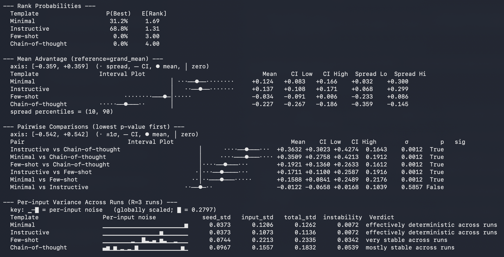
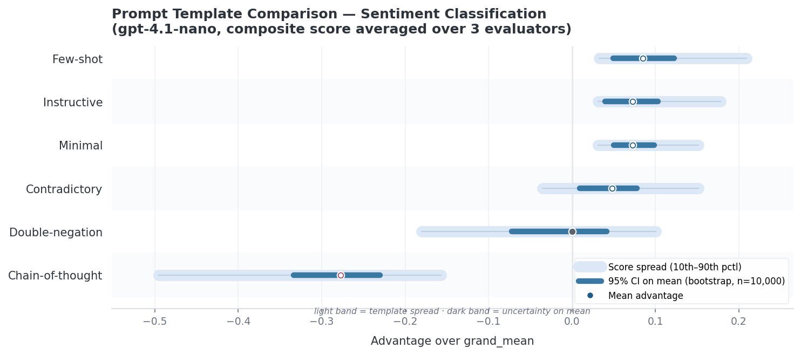
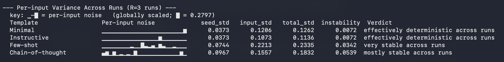

# evalstats

[](https://pypi.org/project/evalstats/)
[](LICENSE)
[](pyproject.toml)

Rigorous statistical analysis for LLM evaluations: from model and prompt comparisons to statistical tests resilient to LLM judge bias, including in small-sample data regimes.

`evalstats` helps you answer questions like:
- Is Prompt A actually better than Prompt B, or just slightly luckier on this dataset?
- Does Model A beat Model B, or only under a specific prompt phrasing?
- Are my performance differences large enough to be meaningful, or just noise?
- How stable are scores across runs, evaluators, or inputs?
- Can I trust my LLM-judge scores, or do they need correcting against human labels first?

You give `evalstats` your benchmark data, and it runs statistically appropriate analyses that quantify uncertainty and provide confidence bounds on your claims, in two main ways:

- **Comparisons**: compare models, prompts, or both at once, and get 95% confidence intervals, pairwise significance tests, and multi-run sensitivity analyses. `evalstats` picks well-calibrated methods by default, backed by simulations, and was built specifically for small-sample datasets (N<100); it will output stats down to 15 samples. See [Recommended Methods](#recommended-methods).
- **PPI-corrected inference**: use a small set of human labels to correct bias in noisy LLM-judge scores, so your means, confidence intervals, and hypothesis-test p-values stay calibrated in the face of LLM judge bias. See [PPI-Corrected Inference](#ppi-corrected-inference-means-cis-and-tests).

Scientists can use our PPI-corrected statistical tests for **mixed human-AI subject studies**, where some observations are human-labeled and the rest are graded by an LLM judge. `evalstats.tests` gives you LLM-judge-bias-corrected versions of:

- t-test (`ttest`, independent or paired; Welch's by default, or Student's equal-variance via `equal_var=True`)
- Mann–Whitney U (`mannwhitney`)
- Wilcoxon signed-rank (`wilcoxon`)
- One-way ANOVA (`anova_oneway`, independent or repeated-measures)
- Friedman test (`friedman`, repeated-measures rank-based)
- Kruskal-Wallis (`kruskalwallis`, independent-groups rank-based)

As long as items for human labeling were sampled at random from the full dataset, p-values stay calibrated even when the LLM judge is biased or miscalibrated, validated via extensive Monte Carlo simulations (see [`simulations/harness`](simulations/harness)). To the best of our knowledge, `evalstats` provides the only known implementations of PPI-corrected rank-based nonparametric tests like Wilcoxon.

> [!IMPORTANT]
> We are actively building out this project. A paper with the full methodology and simulation-backed validation behind every default is forthcoming: see [Recommended Methods](#recommended-methods) and [Citation](#citation). In the meantime, the [Stats for LLM Evals guide](https://statsforevals.com/) covers the same material in web form. If there's something you'd like to see, let us know by raising an Issue.

## Contents

- [Installation](#installation)
- [Quick start](#quick-start)
- [See it in action](#see-it-in-action)
- [Recommended Methods](#recommended-methods)
- [Python API](#python-api)
- [PPI-Corrected Inference](#ppi-corrected-inference-means-cis-and-tests)
- [CLI Reference](#cli-reference)
- [Examples](#examples)
- [Mixed effects models (LMM)](#mixed-effects-models-lmm)
- [Reproducibility: Monte Carlo simulations](#reproducibility-monte-carlo-simulations)
- [Motivation](#motivation)
- [Development and Contributions](#development-and-contributions)
- [Citation](#citation)
- [License](#license)

## Installation

```bash
pip install evalstats
```

For Excel (`.xlsx`) input support: `pip install "evalstats[xlsx]"`. For every optional extra (including mixed-effects/LMM support): `pip install "evalstats[all]"`.

## Quick start

From the command line, `evalstats` can read a CSV or Excel file directly and print a statistical summary:

```bash
evalstats analyze results.csv
```

The input file should have a prompt/template column, an item/input column, and a score column (model, run, and evaluator columns are optional). See the [column alias table](#python-api) below, or run `evalstats analyze --help` for the full option and alias list.

From Python, the main entry point is `load_from()` + `compare()`:

```python
import pandas as pd
import evalstats as es

df = pd.read_csv("results.csv")  # columns: prompt, item, score (model optional)

evaldata = es.load_from(df)
evaldata.summary()  # inspect detected structure/column assignments before analyzing

result = es.compare(evaldata, factors="prompt")
result.summary()  # full terminal report: CIs, pairwise tests, rank probabilities
```

See [Python API](#python-api) for the full data-format and `compare()` reference.

## See it in action

Running `es.compare(evaldata, factors="prompt")` then `result.summary()` prints a full statistical report to the terminal: confidence interval line plots, pairwise comparisons, and per-input stability across runs. Below: a 4-template sentiment-classification benchmark (GPT-4.1-nano, 27 inputs, 3 runs, 3 evaluators).



From this we can see Minimal and Instructive are the most promising candidates, but it's statistically unclear which is better. Chain-of-thought gives the least consistent outputs across runs.

Comparing models and prompts at once, `evalstats` colors in a 4-way tie between four model-prompt combinations:


You can also plot within notebook environments. `plot_point_estimates` shows each template's absolute mean score with marginal confidence intervals:



And LLMs are stochastic at temperature > 0: the "noise plot" visualizes (in)stability across runs for the same input:



## Recommended Methods

`evalstats.compare()` defaults to `method="auto"`, which picks a well-calibrated statistical method based on your data's estimand, data type, and sample size. These defaults come from an extensive Monte Carlo simulation study across eval data types, sample sizes, and comparison setups, cross-checked against real LLM eval data, summarized in the two decision trees below. **Boxed methods are the default; gray notes give the multi-run variant and conservative alternatives.**


A paper with the full methodology, simulation results, and justification behind each recommendation is forthcoming (see [Citation](#citation)). Until then, see the [Which Method?](https://statsforevals.com/which-method.html) page on the `evalstats` site for the web version of these trees, and [`simulations/harness`](simulations/harness) to reproduce the underlying simulations yourself.

## Python API

`evalstats` expects **long-format** data: one row per (item, score) observation, plus whichever axis you want to compare (`model`, `prompt`, or both) and optionally `run` for repeated runs. Only `item` and `score` are strictly required; you need at least one of `model`/`prompt` too, whichever you pass to `compare(factors=...)`. `load_from()` auto-detects each column's role by matching its name (case-insensitively) against this table:

| Role     | Canonical name | Recognized aliases                    | Required?                                          |
|----------|-----------------|----------------------------------------|------------------------------------------------------|
| model    | `model`         | `model_label`, `model_name`            | Optional: needed to compare models (`factors="model"`) |
| prompt   | `prompt`        | `template`, `prompt_template`          | Optional: needed to compare prompts (`factors="prompt"`) |
| item     | `item`          | `input`, `example`, `id`, `input_label`| Yes                                                  |
| score    | `score`         | `value`, `result`, `metric`            | Yes                                                  |
| run      | `run`           | `seed`, `repeat`, `run_id`, `trial`    | Optional: add if you have repeated runs per (model/prompt, item) |

For example, a minimal CSV comparing prompts:

| prompt      | item | score |
|-------------|------|-------|
| Minimal     | q1   | 0.82  |
| Instructive | q1   | 0.91  |
| Minimal     | q2   | 0.75  |
| Instructive | q2   | 0.88  |

If your columns don't match any alias above, remap them explicitly: `es.load_from(df, col_map={"llm": "model", "variant": "prompt", "q_id": "item"})`.

`compare()` also handles:

- **Comparing models**: `factors="model"`
- **Factorial designs** (model × prompt): `factors=["model", "prompt"]` (routes to an LMM backend)
- **Filtering**: any keyword matching a column name acts as a row filter, e.g. `es.compare(evaldata, factors="model", split="test")`
- **PPI-corrected inference** for noisy LLM-judge scores: see [PPI-Corrected Inference](#ppi-corrected-inference-means-cis-and-tests)

The returned `result` is a `ComparisonResult`. Besides `.summary()`, it has `.to_frame()` / `.to_dict()` for programmatic access, `.plot(method="forest" | "bar" | "cd" | "pareto")` for charts, and `.disagreements()` to surface the items entities disagree on most.

<details>
<summary><strong>Advanced: raw score arrays (low-level engine)</strong></summary>

`compare()` is a wrapper around a lower-level engine, `analyze()`, which operates directly on `BenchmarkResult` / `MultiModelBenchmark` objects (numpy score arrays) rather than a DataFrame. Reach for this path only if you already have scores as arrays and don't want to build a DataFrame first. Most use cases should use `compare()` above.

```python
import numpy as np
import evalstats as estats

# Example raw scores for 4 templates × 3 inputs (single run, single evaluator)
your_scores = [
    [0.91, 0.88, 0.86],
    [0.90, 0.89, 0.84],
    [0.85, 0.82, 0.80],
    [0.79, 0.76, 0.74],
]
n_templates, n_inputs = 4, 3

# scores shape: (n_templates, n_inputs, n_runs, n_evaluators)
scores = np.array(your_scores).reshape(n_templates, n_inputs, 1, 1)

result = estats.BenchmarkResult(
    scores=scores,
    template_labels=["Minimal", "Instructive", "Few-shot", "Chain-of-thought"],
    input_labels=[f"input_{i}" for i in range(n_inputs)],
)

analysis = estats.analyze(result, reference="grand_mean", n_bootstrap=5_000)
analysis.summary()  # same terminal report as ComparisonResult.summary()
```

If you want this lower-level path from a DataFrame (e.g. to inspect the raw `BenchmarkResult` object, or fine-tune `strict_complete_design`), use `from_dataframe()` instead of `load_from()`. It returns the array-based `BenchmarkResult` / `MultiModelBenchmark` plus an optional `DataLoadReport`, a data-quality log of coercions/repairs made while parsing:

```python
import evalstats as estats

benchmark, load_report = estats.from_dataframe(
    df, format="auto", repair=True, strict_complete_design=True, return_report=True,
)
for line in load_report.to_lines():
    print(line)

analysis = estats.analyze(benchmark)
analysis.summary()
```

To visualize absolute prompt performance directly from a `BenchmarkResult`, bypassing `analyze()`:

```python
fig = estats.plot_point_estimates(result)
fig.savefig("mean_performance.png", dpi=150, bbox_inches="tight")
```

</details>

## PPI-Corrected Inference (Means, CIs, and Tests)

PPI (Prediction-Powered Inference) lets you use lots of cheap LLM judgments plus a smaller set of human labels to correct measurement error from the LLM judge, giving you corrected estimates and uncertainty that better reflect what you'd have gotten from a fully human-labeled study (Angelopoulos et al., 2023). Most corrections use PPIBoot (bootstrap variant of PPI; Zrnic, 2024), battle-tested via simulations (see [`simulations/sim_type_i_calibration.py`](simulations/sim_type_i_calibration.py)).

> [!IMPORTANT]
> **Which items get a human label must be chosen uniformly at random.** PPI correction assumes the labeled subset is representative of the full dataset. If your labeling process instead targets specific items — e.g. "always double-check the borderline or highest-scoring responses" — that's missing-not-at-random (MNAR) selection on the outcome, and PPI correction can stay badly miscalibrated **no matter how many items you label**. This isn't ordinary small-sample noise that more labels fixes; confirmed in simulation to persist from 15 up through 300 labeled items out of 400. See `evalstats.ppi.correct`'s docstring for the full analysis, and use `evalstats label` (below) to draw a compliant random sample.

### Comparing models with corrected LLM judge evals via `compare(..., alignment=...)`

```python
import evalstats as es

# Dataframe columns include: model  item  llm_score  human_score (NaN for unlabeled rows)
evaldata = es.load_from(df)

alignment = es.judge_alignment(evaldata, llm_metric="llm_score", human_groundtruth="human_score")

result = es.compare(
    evaldata, factors="model", metric="llm_score", alignment={"llm_score": alignment},
)
result.summary()
```

### T-test PPI-correction via `evalstats.tests.ttest`

```python
import evalstats as es

res = es.tests.ttest(
    a=llm_a, b=llm_b,
    a_lab=human_a,  # same length as llm_a, NaN where unlabeled
    b_lab=human_b,  # same length as llm_b, NaN where unlabeled
    paired=False, print_result=False,
)
print(res.p_value, res.corrected_p_value, res.corrected_ci)
```

<details>
<summary><strong>More PPI-corrected tests: Mann-Whitney U, Wilcoxon, one-way ANOVA</strong></summary>

**Mann-Whitney U** (`evalstats.tests.mannwhitney`): nonparametric two-group comparison based on relative ranks rather than assuming normally distributed scores:

```python
res = es.tests.mannwhitney(x=llm_x, y=llm_y, x_lab=human_x, y_lab=human_y, print_result=False)
print(res.p_value, res.corrected_p_value, res.corrected_ci)
```

**Wilcoxon signed-rank** (`evalstats.tests.wilcoxon`): nonparametric paired test for matched observations (before/after, A/B on the same items, etc.):

```python
res = es.tests.wilcoxon(x=llm_before, y=llm_after, x_lab=human_before, y_lab=human_after, print_result=False)
print(res.p_value, res.corrected_p_value, res.corrected_ci)
```

**One-way ANOVA** (`evalstats.tests.anova_oneway`): more than two groups; pass `repeated=True` for repeated-measures (same subjects across conditions):

```python
res = es.tests.anova_oneway(
    llm_g1, llm_g2, llm_g3,
    groups_lab=[human_g1, human_g2, human_g3], repeated=False, print_result=False,
)
print(res.p_value, res.corrected_p_value, res.corrected_ci)
```

</details>

## CLI Reference

```bash
evalstats analyze results.csv       # full statistical report from a CSV/XLSX file
evalstats label results.csv         # draw a random, MCAR-compliant sample of items for human labeling
```

`evalstats label` picks a uniformly random sample of items per condition (respecting the PPI sample-size floors: 15 minimum, 30 recommended) and writes a CSV/XLSX with a `human_<metric>` column ready for grading, the safe way to build the labeled subset `alignment=`/`*_lab` needs above. Run `evalstats label --help` for the full option list.

Once that column is filled in, `--human-groundtruth` marks the metric as an untrusted LLM-judge score and runs the same correction from the command line: `judge_alignment()` first, printing its report, then a PPI-corrected `compare()`.

```bash
evalstats analyze results.csv --metric score --human-groundtruth human_score --label-selection random --p-values
```

Pass `--score-range LO HI` (e.g. `--score-range 1 5` for a Likert scale) so the bounded CI methods are used. Without it, `analyze` infers the data kind from the values and prints what it assumed; if that guess is wrong, the fix is to declare the range.

## Examples

`examples/` has 25+ runnable, self-contained scripts covering common workflows: synthetic and OpenAI-backed benchmarks, multi-run comparisons, PPI-corrected judge alignment, factorial designs, and reliability/robustness demos. From the repository root:

```bash
python examples/synthetic_mean_advantage.py      # no API key needed
python examples/sentiment.py                     # OpenAI sentiment benchmark
python examples/sentiment_multirun.py             # captures run-to-run variability
python examples/compare_models_multirun.py        # multi-model comparison across prompts
python examples/compare_alignment_ppi.py           # PPI-corrected judge comparison
```

OpenAI-powered examples require `OPENAI_API_KEY` set in your environment, but the model calls are easy to swap for whichever provider you prefer.

## Mixed effects models (LMM)

> [!IMPORTANT]
> Mixed effects analysis is experimental, currently offering only graceful handling of missing data (assumed reasonably random). Use `method="lmm"` if you need robustness to missing (`NaN`) cells; factor decomposition across multiple input factors is planned.

`evalstats` supports mixed-effects models (`score ~ template + (1|input)`) for missing data and multi-factor decomposition. The default backend is pure-Python `statsmodels`, no extra setup required:

```python
analysis = estats.analyze(result, method="lmm")
```

This fits the model with REML, computes Wald CIs via the delta method, and estimates rank distributions by parametric simulation.

<details>
<summary><strong>Optional backend: pymer4 (requires R)</strong></summary>

For Satterthwaite degrees of freedom and `emmeans`-based pairwise contrasts (R's gold standard for mixed models), pass `backend="pymer4"`:

```python
analysis = estats.analyze(result, method="lmm", backend="pymer4")
```

This requires a working R installation with:

```r
install.packages(c("lme4", "emmeans", "tibble", "broom", "broom.mixed", "lmerTest", "report", "car"))
```

Then `pip install "evalstats[lmm]"`. If your environment needs manual dependency pinning, this is the tested equivalent:

```bash
pip install "pymer4>=0.9" great_tables joblib rpy2 polars scikit-learn formulae pyarrow
```

Installation details may differ on your system.

</details>

## Reproducibility: Monte Carlo simulations

Claims in this README and on the [`evalstats` site](https://statsforevals.com/) like "verified in our simulations" are backed by a runnable harness in [`simulations/harness/`](simulations/harness):

```bash
python -m simulations.harness.cli --list-cases
python -m simulations.harness.cli --official-tests
python -m simulations.harness.cli ci_single --reps 50 --sizes 10 20
python -m simulations.harness.cli pvalues --mode ppi --tests ttest wilcoxon anova_rep
```

`--official-tests` brings up a CLI to run each case's canonical, full-scale preset, writing results plus a `manifest.json` (args, output paths, key metrics, pass/fail) to `simulations/out/official_<timestamp>/`. See [`simulations/harness/README.md`](simulations/harness/README.md) for the full case list and scenario library. Note that each simulation can take a long time to run. Even parallelized across many cores, official-scale runs can take hours.

- `ci_single` / `ci_paired`: coverage and width of confidence interval methods across synthetic distributions and real benchmark data (OpenEval, Inspect AI).
- `pvalues --mode pairwise` / `--mode multiarm`: Type-I error and power for pairwise and multi-arm comparisons, including FWER correction strategies.
- `pvalues --mode ppi`: Type-I error calibration and power for every PPI-corrected test in `evalstats.tests`, swept across judge-bias severity, label fraction, and MNAR-labeling scenarios.

## Motivation

Most eval tools in the LLM evaluation space don't help users perform *any* statistical tests. They present bar charts of average performance, and developers glance at the chart and decide "prompt/model A is better than B." But was it really? Relying on bar charts and averages alone can easily lead to erroneous conclusions: B might be more robust than A, or perform better on an important data subset, or there might not be enough data to conclude either way.

People do evals this way because they don't have the time, tools, or statistical knowledge to do better. Often they don't even know there's a better way. `evalstats` aims to rectify this with simple, powerful defaults: throw us your data, and we'll run the stats and plot the results for you.

## Development and Contributions

For package build, release validation, and maintainer workflows, see [DEVELOPMENT.md](DEVELOPMENT.md).

We welcome contributions, especially refinements to our statistical methods. If you're proposing a new correction, CI method, or a fix to an existing one, battle-test it against the [simulation harness](#reproducibility-monte-carlo-simulations) first. Add or extend a scenario and confirm your change holds up on Type-I error and power, not just on the case that motivated it, before opening a PR.

## Citation

`evalstats` doesn't have a paper yet. One covering the full simulation-backed method validation is forthcoming. Until then, please cite the GitHub repository:

```bibtex
@software{arawjo_evalstats,
  author  = {Arawjo, Ian},
  title   = {evalstats: Statistically Sound Analysis for LLM Evaluations},
  url     = {https://github.com/ianarawjo/evalstats},
  year    = {2026}
}
```

or in prose: Ian Arawjo, *evalstats* (GitHub: [ianarawjo/evalstats](https://github.com/ianarawjo/evalstats)).

## License

This repository uses two licenses:

- **`evalstats` package** (everything outside `website/`): [MIT](LICENSE).
- **Stats for Evals Website** (everything in `website/`): [CC BY-NC-ND 4.0](website/LICENSE). You may share it with attribution non-commercially, but commercial use and derivative works are not permitted.
